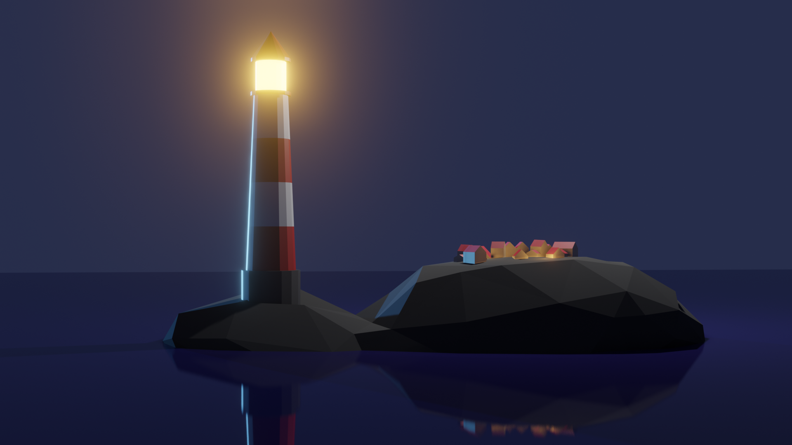

# 🚀 Creative & Technical Portfolio

Welcome to my public showcase! This repository serves as a central hub for my latest work in **Unity Game Development** and **3D Modeling & Shading (Blender)**. 

> 🔒 **Note on Source Code:** The underlying project repositories are currently set to **Private** to protect proprietary assets and source code. If you are a recruiter or technical interviewer and would like a deep-dive look into the codebase, architectural choices, or project structures, please feel free to request access!

---

## 🎮 Unity Game Development

### 🔹 Top-Down Shooter Prototype
*A fast-paced, responsive prototype focusing on clean architecture, smooth player controls, and modular weapon systems.*

| Preview | Project Details |
| :--- | :--- |
|  | **🔧 Tools & Tech:** Unity, C#, New Input System, ScriptableObjects  **✨ Key Features:** • Scalable enemy spawning logic  **🔗 Project Hub:** [Private Repository](https://github.com/JaneChuang/top-down-shooter-prototype) |

### 🔹 Kawaii Watermelon
*A charming, physics-based puzzle/casual game prototype focusing on juice-splashing mechanics and polished particle effects.*

| Preview | Project Details |
| :--- | :--- |
|  | **🔧 Tools & Tech:** Unity, 2D/3D Physics, Particle Systems, URP  **✨ Key Features:** • Custom collision handling • Satisfying juice & splash VFX  **🔗 Project Hub:** [Private Repository](https://github.com/JaneChuang/Kawaii-Watermelon) |

---

## 🎨 3D Modeling & Shading (Blender)

### 🔹 Tropical Beach Diorama
*A vibrant, Pixar-style miniature environment loop featuring custom modifier-based wind physics and high-fidelity global illumination.*

| Preview | Project Details |
| :--- | :--- |
|  | **🔧 Tools & Tech:** Blender 4.2, Cycles Engine, Simple Deform Modifier, Timeline Keyframing  **✨ Key Features:** • Seamless, procedural 250-frame animation loop • Advanced path-traced lighting & translucent water shader setups  **🔗 Project Hub:** [Private Repository](https://github.com/JaneChuang/blender-stylized-beach-diorama/tree/main) |

### 🔹 Procedural Halftone Shader
*A custom, non-photorealistic rendering (NPR) shader that dynamically creates comic-book style halftone dots based on scene lighting.*

| Preview | Project Details |
| :--- | :--- |
|  | **🔧 Tools & Tech:** Blender, EEVEE, Shading Nodes  **✨ Key Features:** • 100% procedural (no external textures) • Dynamic reaction to light sources and shadows  **🔗 Project Hub:** [Private Repository](https://github.com/JaneChuang/blender-procedural-halftone-shader) |

### 🔹 Blender Lighthouse
*A stylized, atmospheric low-poly environmental scene utilizing customized lighting setups to convey a specific mood.*

| Preview | Project Details |
| :--- | :--- |
|  | **🔧 Tools & Tech:** Blender, Cycles, Low-Poly Modeling  **✨ Key Features:** • Composition & dramatic volumetric lighting • Clean, optimized geometry  **🔗 Project Hub:** [Private Repository](https://github.com/JaneChuang/blender-lighthouse) |

### 🔹 Mushrooms in a Bottle
*A highly detailed, whimsical miniature world focusing on glass refraction, organic modeling, and hand-crafted texturing.*

| Preview | Project Details |
| :--- | :--- |
|  | **🔧 Tools & Tech:** Blender, Material Nodes, Organic Sculpting  **✨ Key Features:** • Advanced glass shader setup • Intricate asset placement within a confined space  **🔗 Project Hub:** [Private Repository](https://github.com/JaneChuang/blender-mushrooms-in-bottle) |

---

## ➕ How to Request Code Access
If you are evaluating my technical skills for a role, I would be happy to grant you temporary access to any of the private repositories listed above, or jump on a call to walk you through the code structure.

* 📧 **Email:** chuangchihyun@gmail.com

Thank you for visiting!
